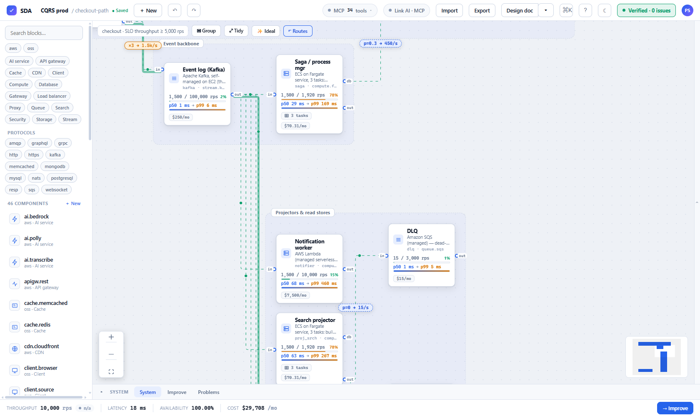
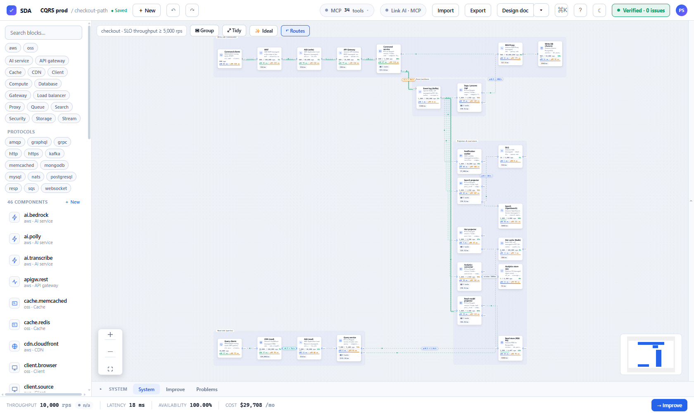
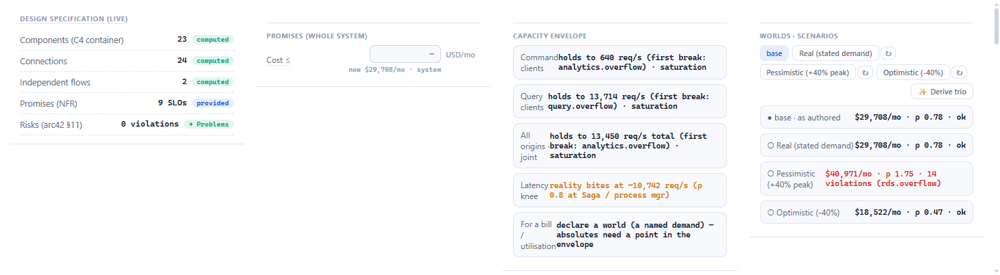
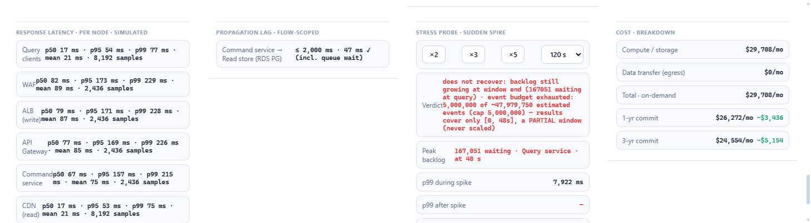

<div align="center">

# System Design Assistant

**A fully client-side tool that _computes_ your architecture — it doesn't just draw it.**

Drag building blocks onto a canvas, connect them, and a real engine evaluates the design as you
work: capacity, queueing-aware latency, tail percentiles, availability, delivery guarantees and cost.
Run it backwards and the solver _sizes the design for you_. Every number is sourced or marked
`unknown` — the tool is built so it **cannot lie**.

### [▶ Try SDA live](https://psluja.github.io/system-design-assistant/)

<sub>No install, no account — the whole engine runs in your browser and designs stay on your machine.
Curious how honest its numbers are? [The live trust & fidelity trends](https://psluja.github.io/system-design-assistant/trust.html).</sub>

[](https://psluja.github.io/system-design-assistant/)
[](LICENSE)
[](#status)
[](tsconfig.base.json)
[](#your-designs-never-leave-the-browser)
[](#testing)
[](.github/CONTRIBUTING.md)



<sub>A slice of the `cqrs-production-large` example, ideal-laid-out. Every node carries **computed**
live numbers — utilisation ρ, simulated p50→p99 latency, monthly cost, replica counts — and the wires
carry the flow algebra (`×3`, `p=0.3`). Nothing here is typed in by hand.</sub>

</div>

---

## Why this exists

Diagram tools draw boxes and arrows; they can't tell you whether the design _works_. SDA treats an
architecture as a **typed-property graph** and runs four solvers over it, so a picture becomes a
**verified model**: it computes the bottleneck, the real end-to-end latency (queue included), the p99
tail, the monthly bill, and — run backwards — the cheapest configuration that still meets every SLO.
When a number can't be sourced, it says `unknown` instead of guessing.

## Your designs never leave the browser

There is **no backend**. Every solver — [MiniZinc](https://www.minizinc.org/) (exact optimization),
[clingo](https://potassco.org/clingo/) (topology synthesis), [DataScript](https://github.com/tonsky/datascript)
(relational legality), a discrete-event simulator (true tail latency), and an optional WebGPU Monte
Carlo pass — runs **client-side as WebAssembly or pure TypeScript**. State lives in your browser
(IndexedDB) and in a versioned, diffable `.sda.json` export that you own. Nothing is uploaded,
tracked, or phoned home. _(The shipped app makes zero network calls to any non-local host.)_

## Quickstart

```bash
git clone <this-repo> && cd SystemDesignAssistant
pnpm install
pnpm dev            # the web app on http://localhost:5173
```

That's it — no services, no keys, no cloud. Open the app, click **Open the CQRS example**, or
**Import** any file from [`examples/`](examples/) (the hero above is
[`examples/cqrs-production-large.sda.json`](examples/cqrs-production-large.sda.json)).

## What it does

Every capability below is a real, tested feature — 20 shipped features across 51 algorithmic modules,
each with its user story, the surfaces it ships on, and where it's tested end-to-end.

- **Live verdicts, not static pictures.** Every edit re-evaluates the whole design: overflow at each
  tier, the real (queueing-aware) response latency, availability, a monthly cost breakdown — with
  cause chains and ranked remediations. _(System evaluation & roll-up)_
- **True tails.** A discrete-event simulation runs off-thread and reports p50/p95/p99 — the numbers a
  scalar model cannot honestly produce — and turns them into real SLO verdicts. _(Response percentiles
  & real-aware verdicts)_
- **Runs backwards.** `Improve` solves the design as an optimization problem: _meet every SLO with the
  minimal change_, _cheapest under SLOs_, or _fastest_; `explain_infeasible` says why when it can't.
  _(Backward search: optimize / repair / explain_infeasible)_
- **Synthesizes topologies.** `synthesize` / `compare_options` enumerate whole designs (or every block
  that legally fits a slot), size each to the SLOs, and rank the verified survivors — a fair
  Fargate-vs-Lambda-vs-ASG comparison in one call. _(Synthesis & compare-options)_
- **Models your uncertain world.** Declare ranges on soft inputs and every conclusion becomes a
  distribution — percentiles, SLO confidence, a tornado — with an optional WebGPU backend. Compare
  pessimistic / real / optimistic **worlds** in one matrix. _(Assumption uncertainty · Worlds / trio)_
- **Finds the breaking point.** The **capacity envelope** shows the maximum sustained load each origin
  can carry with every SLO still green — and what breaks first. A one-click **spike probe** answers
  "does it survive a sudden overload, and how long does it take to drain?" _(Capacity envelope · Spike
  probe · Retry feedback & goodput collapse)_
- **Catches the invisible bugs.** Per-flow **consistency / ordering / delivery** guarantees and
  **lag SLOs** (CDC/replication deadlines that include async queue waits) — the computed end-to-end
  token, the provable root-cause hop, and the cheapest same-family fix. _(Delivery guarantees · Lag
  SLOs)_
- **Typed protocol ports.** Ports carry real protocol capability sets (official names — PostgreSQL
  wire protocol, RESP, Kafka protocol, …). A queue can drive a Lambda; it cannot drive Postgres — and
  the canvas, the suggester and the quick-add picker all enforce the same single predicate. _(Flow
  transforms & the legality suggester)_
- **Authors the deliverable.** One click turns the verified model into an architect's design document
  (self-contained HTML or Markdown) with **computed** NFR numbers — promises, capacity, a C4 view,
  cost, reliability, bottlenecks, an assumption register. Nothing hand-entered. _(Design-doc
  generator)_
- **Semantic auto-layout.** The **Ideal** button reads tiers and flow left-to-right, straightens
  wires and never fights your pinned nodes — the layout in every screenshot here. _(Ideal layout)_
- **AI-native.** A 34-tool **MCP server** (and a local AI bridge to the live canvas) lets an agent
  design, evaluate, simulate and repair with the same tools a human uses — editing the very
  `.sda.json` you have open. _(File-based IO · Honest solver escalation)_

### See the whole verified design



The complete 23-container CQRS system — command side, event backbone, projectors and read stores,
query side — ideal-laid-out, `Verified · 0 issues`, at a computed **$29,708/mo**.

### It computes verdicts, promises, capacity and worlds



The System panel is a pure projection of the model: the live design spec, the whole-system cost
promise, the **capacity envelope** (each origin's ceiling and what breaks first, plus the queueing
knee), and the **worlds** matrix — pessimistic peak (`14 violations`), real, and optimistic — each
with its own cost and utilisation.

### True tails and honest behaviour under load



Per-node p50/p95/p99 from the discrete-event simulation, a flow-scoped propagation-lag SLO
(`≤ 2,000 ms · 47 ms ✓`, async waits included), the spike-probe verdict, and a cost breakdown with
1-yr / 3-yr commitment discounts. Note the spike verdict is _honest_ about its own limits — it reports
a partial simulation window rather than extrapolating.

## Architecture

```
engine/     domain-agnostic core: typed-property graph, relation language, fixpoint solver,
            cell network, MiniZinc / DataScript / clingo adapters, discrete-event simulator
content/    ALL system-design meaning, as data: property registry, component manifests
            (AWS archetypes, OSS staples, real CDK cases), protocol vocabulary, projectors
app/
  core/     the Studio command core (undo/redo, persistence, custom components)
  presenter/ shared view-models — every shell renders these verbatim
  web/      the browser shell (React + React Flow canvas)
  vscode/   the VS Code shell (custom editor + native views)
  mcp/      MCP tools (design, evaluate, simulate, optimize, synthesize) for AI agents
  bridge/   a local MCP↔WebSocket relay that lets an AI drive the LIVE canvas
```

The engine is **domain-agnostic** — it computes over a typed-property graph and knows nothing about
clouds. Every AWS/OSS meaning lives in `content/` as data (component manifests). Four solvers, one
mechanism each:

| Question | Solver | Role |
|---|---|---|
| Is this legal? What fits here? | **DataScript** (Datalog) | relational legality / suggester |
| What are the numbers? Size it. | **MiniZinc** (WASM) | evaluate (all fixed) · optimize / repair (free vars + objective) |
| What whole topologies are valid? | **clingo** (ASP) | enumeration / synthesis |
| What happens over time? | **DES** (TypeScript) | dynamics, transients, true percentiles |

Where solvers overlap, they are **differential-tested against each other** (and MiniZinc against a
COIN-BC reference) — the guard against "the tool lies".

## Two shells, one engine

| | |
|---|---|
| **Web app** | The full canvas experience in any modern browser. `pnpm dev` |
| **VS Code extension** | `.sda.json` opens as a canvas **custom editor** with native everything: the Problems panel _is_ the engine's verdicts, tree views for components/inspector/system, SLOs as native Tests, Improve as a Refactor Preview, hover/CodeLens on the raw JSON. Build: `pnpm --filter sda-vscode run package` (produces `sda-vscode-0.0.43.vsix`) |

Both shells render the same shared view-models (`@sda/presenter`) over the same engine — they cannot
drift.

## Local development

```bash
pnpm install
pnpm dev                     # web app on http://localhost:5173
pnpm build                   # production web build
pnpm -r typecheck            # strict TypeScript across all 12 packages
pnpm test                    # the full Vitest suite
pnpm catalogs                # regenerate docs/FEATURES.md + docs/ALGORITHMS.md from @feature/@algorithm headers
```

Drive the live canvas from an external AI agent with the bridge:

```bash
node app/bridge/src/index.ts   # MCP-over-HTTP at http://localhost:7777/mcp, relayed to the open canvas (click "Link AI")
```

### Testing

Over **2,400 tests** across 12 packages: property-based tests over generated architectures,
**differential** tests asserting the solvers agree, **golden** + **migration** tests for the export
format, and validation of the simulator against closed-form queueing models (M/M/1, M/M/c,
Pollaczek–Khinchine, Little). The exact-optimization differential tests use a native MiniZinc when one
is on `PATH`; everything else is fully self-contained.

## Documentation

The feature and algorithm catalogs and the fidelity report are generated from the source — run
`pnpm catalogs` to produce them. Detailed design documentation is published separately.

## Status

**Beta · pre-publication.** The engine and content pack are built and validated (all four solver
paradigms, honest verdicts, backward search, the assumption model); the web and VS Code shells run the
full loop. Interfaces and the export schema (currently version 10, with migrations back to version 1)
may still change before a tagged release. Known honest limits are stated in the feature catalog — e.g.
per-class tails and backward search for request classes are declined by design, not faked.

## The invariants (why you can trust the numbers)

These are enforced, not aspirational:

- **No required backend.** Fully client-side; every solver is consumed as prebuilt WASM or pure TS.
  Optional local adapters (engine-as-MCP, the bridge) are plain Node, never a required server.
- **The tool must not lie.** Numbers are sourced or marked `unknown`; uncertainty is a value, never a
  guess. Overlapping solvers are differential-tested.
- **The engine is domain-agnostic.** `grep` the engine for `aws` / `lambda` / `dynamodb` ⇒ zero. All
  cloud meaning is content (data), and a guard test keeps it that way.
- **Closed framework, open content.** Only content extends the tool (components + registry keys, as
  data). The engine is closed for modification.
- **The export file is the backup.** Browser-only persistence (IndexedDB) plus a versioned, diffable
  `.sda.json` export that records plugin versions and migrates forward.

## Contributing

See **[CONTRIBUTING](.github/CONTRIBUTING.md)**. The short version: strict TypeScript, every change
lands with tests, the engine stays domain-agnostic, and the tool must not lie. AI-assisted
contributions are welcome and disclosed — this project is itself built with AI pair-engineering.

## License

[MIT](LICENSE) © 2026 Piotr Słuja and contributors. Bundled third-party solvers and libraries keep
their own licenses — see [THIRD_PARTY_NOTICES](THIRD_PARTY_NOTICES.md).
