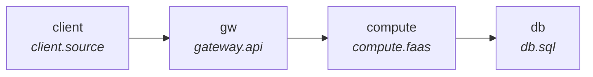

# Design Document — Checkout API

> Generated from the verified SDA model. Every metric below is **computed by the engine** from the live design — not hand-entered. Sections marked *author required* are narrative the tool does not model; they are listed so the gating hallmarks (resilience, security, cost, alternatives) are never silently missing.

## 1. Context & background

**Checkout API** — 4 components, 1 independent request flow(s).

- **compute** — runs the checkout command

_Business context, drivers and scope: author required._

## 2. Goals & non-goals

**Goals** — meet the 2 declared SLO(s):
- Throughput at **db** target 1000
- Availability at **db** ≥ 99.9900%

_Non-goals: author required._

## 3. Promises (non-functional / SLOs)

| Node | Metric | Promise | Computed | Status |
|---|---|---|---|---|
| db | Throughput | target 1000 | 600 req/s | ⚠ warning |
| db | Availability | ≥ 99.9900% | 99.890% | ✗ violation |

## 4. Capacity & estimation

End-to-end per request flow — **Latency is measured** (discrete-event simulation, seed 7); a flow whose terminal the simulation never timed reads _no data_ (never an estimate):

| Flow | Throughput | Latency | Availability | Branch cost |
|---|---|---|---|---|
| client → db | 600 req/s | 40 ms | 99.890% | $295/mo |

**Tail latency (simulated, busiest flow):** p50 40 ms · p95 120 ms · **p99 260 ms** — the number a reviewer judges by, not the mean.

**Saturation & overflow (a tier at/over capacity — the bottleneck to fix):**

| Node | Condition |
|---|---|
| compute | overflow 400 req/s (rejected/dropped/throttled) |
| db | overflow 400 req/s (rejected/dropped/throttled) |

## 5. High-level architecture (C4 container view)

## 6. Cost analysis

| Line | Monthly |
|---|---|
| Compute / storage / managed | $295 |
| Data transfer (egress) | $4665.6 |
| **Total (on-demand)** | **$4960.6** |
| With 1-yr commitment | $4862.6 _(−$98)_ |
| With 3-yr commitment | $4813.6 _(−$147)_ |

Per-component (compute/storage):

| Node | Monthly cost | Share |
|---|---|---|
| db | $200/mo | 68% |
| gw | $50/mo | 17% |
| compute | $45/mo | 15% |

_Egress @ ~$0.09/GB internet data-transfer (set each tier's payload). Committed pricing (AWS Compute Savings Plans / RIs) applies to the eligible compute/db spend ($245/mo) — illustrative 40% (1-yr) / 60% (3-yr)._

## 7. Reliability

**client → db: 99.890%** — meets the 99.000% tier (max 3 days 15 hours/yr; Batch processing, data extraction, transfer, and load jobs).

> Achieves 99.00% (max 3 days 15 hours/yr — Batch processing, data extraction, transfer, and load jobs) but the target 99.99% (max 52 minutes/yr — Video delivery, broadcast workloads) is not met. The weakest hard dependency is "gw" (99.95%). AWS remedy: availability is raised by INDEPENDENT redundancy — add a second independent component in another Availability Zone (effective availability = 100% − product of failure rates; two independent three-nines components → six nines). For Region-loss resilience choose a DR tier by RTO/RPO (Backup & Restore → Pilot Light → Warm Standby → Multi-site Active/Active), the cheapest whose RTO and RPO both meet the requirement.

_Source: AWS Well-Architected Reliability Pillar — Availability (https://docs.aws.amazon.com/wellarchitected/latest/reliability-pillar/availability.html)._

## 8. Scalability & bottleneck analysis

- **✗ violation: Overflow at compute (400 req/s), Overflow at db (400 req/s).**
  - Cause: computed 400 req/s is the binding maximum (origin) (at compute).
  - Fix: Reduce overflow at compute (currently 400 req/s) — the dominant maximum.
- **⚠ warning: Throughput at db (600 req/s).**
  - Cause: computed 600 req/s is the binding minimum (origin) (at compute).
  - Fix: Increase throughput at compute (currently 600 req/s) — the binding bottleneck.
- **✗ violation: Availability at db (99.890%).**
  - Cause: configured 0.9995 ratio is the binding factor (origin) (at compute).
  - Fix: Increase availability at compute (currently 0.9995 ratio) — the weakest factor.

## 9. Failure modes & resilience

_Timeouts, retries + jitter, idempotency, circuit breakers, backpressure: author required. (SDA verifies series availability and overflow above; the resilience narrative is yours.)_

## 10. Security & privacy

_IAM / least-privilege, encryption, trust boundaries, threat model: author required (not yet modelled by SDA)._

## 11. Alternatives considered & trade-offs

_The staff-vs-junior hallmark. Run `compare_options` per node to source the cheaper/faster alternative, then record the trade-off here._

## 12. Rollout / migration & open questions

_Deploy / rollback plan, migration steps, open questions: author required._

## Completeness (doc-7 gating sections)

| Section | Source |
|---|---|
| Promises / SLOs | ✓ generated from the model |
| Capacity & estimation | ✓ generated from the model |
| Architecture (C4) | ✓ generated from the model |
| Cost analysis | ✓ generated from the model |
| Reliability | ✓ generated from the model (sourced) |
| Bottleneck analysis | ✓ generated from the model |
| Failure modes & resilience | ⚠ author required |
| Security & privacy | ⚠ author required |
| Alternatives & trade-offs | ⚠ author required (use compare_options) |
| Rollout / migration | ⚠ author required |
